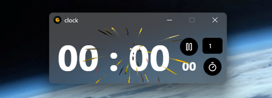

# Clock/Timer

    

## About
Simple Clock/Timer with a firework if the timer expired :fireworks:. 

## Live Development

To run in live development mode, run `wails dev` in the project directory. 

## Building

To build a redistributable, production mode package, use `wails build`.
